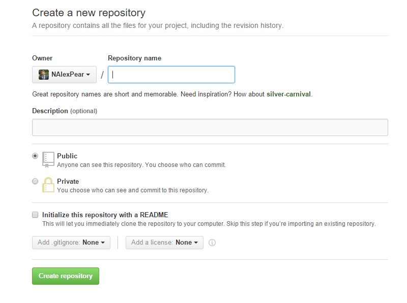

## HTML5, style, git, and CSS
### Getting stylish

At this point, everyone should have the first version of their personal portfolio website deployed through Firebase. As cool as that is, though, there's still just **one** local copy of the website. And there are no save states to revert to in case that copy develops breaking bugs (which is part of the learning process!). Luckily, we have a few tools already installed to help us out with this problem.

### Version Control with `git`
To help us maintain, back up, and share our codebases, we're going to use `git` (the command-line tool) and GitHub (the online repository). These tools are fundamental parts of the web developer's workflow, and you'll be using them *every day* for the rest of your programming career!

`git` works a bit like Apple's Time Machine, in the sense that you'll be able to revert to any saved state within a directory. So if you mangle your site's directory structure, you can always use `git` to revert back to simpler times. The important things to understand about `git` specifically, though:
1. This is a CLI utility, so get ready for lots of text. All of our important files when programming will be text, so its only natural that we'd be navigating between save states (called 'commits') using text as well.
2. Arbitrarily or automatically saving code is NOT a feature of `git`, and it shouldn't be. You only want to save meaningful chunks of code (e.g. a feature), not broken pieces here and there. Otherwise, there's no way to revert back to a useful save-state!
3. Because of point \#2, 'saving' your progress with `git` is handled a bit differently. *You* are in charge of 'staging' your commits, and 'committing' changes only when *you* are ready.


#### EXERCISE 1

Let's get our feet wet with `git` by configuring our user identity.

1. In any command prompt, type the following (using your name and email, of course):
```shell
$ git config --global user.name "Firstname Lastname"
$ git config --global user.email "your.email@example.com"
```
2. You can check all of your configuration settings by typing
```shell
$ git config --list
```

That wasn't so bad, right?

---


#### EXERCISE 2

`git` works by creating a folder within the 'working directory' (the directory that you would like to track/save over time). The first step to saving any project, then, is to navigate to this 'working directory' and create that `git` folder (named `.git`). Let's set up **two** `git` repositories to track over time.
1. First, navigate to your `SavvyCoders` directory.
2. Then, let's create a folder for all of your exercises and 'scratch work' throughout the course (HINT: `mkdir exercises`). Not every `git` repo has to be a website!
3. Navigate into the `exercises` directory, and create a Markdown file called `README.md`.
```shell
$ cd exercises
$ touch README.md
```
4. Use Atom to create a quick greeting for future viewers of your `exercises` directory in `README.md`. Just 3-4 sentences explaining who you are, what this folder is for, and a way of contacting you with questions.
5. Then, while still the `exercises` directory, type the following:
```shell
$ git init
```
6. That *should* have created a `.git` folder, which is hidden by default. There are two ways to make sure that our `git init` command worked. Try these both out:
  + list all of the hidden folders (including `.git`) in `exercises`:
  ```shell
  $ ls -a
  ```
  You should see a folder called `.git` in the output.
  + try running a simple `git` command:
  ```shell
  $ git status
  ```
  If you get `FATAL: exercises is not a git repository`, something has gone wrong. If everything worked, you should see something like this:
  ```
  $ git status
  On branch master
  Initial commit
  Untracked files:
    (use "git add <file>..." to include in what will be committed)
          README.md
  nothing added to commit but untracked files present (use "git add" to track)
  ```
7. Once `git` is *initialized* (`init` = initialize), we should be able start saving snapshots of our work. Before committing our work, though, we have to *stage* our changes. You can do that with the following command:
```shell
$ git add .
```
That `.` at the end is very important! That's telling `git` to stage everything in the working directory at once. To make sure that everything worked, type in `git status` again. You should get output that looks something like this:
```shell
$ git status
On branch master
Initial commit
Changes to be committed:
  (use "git rm --cached <file>..." to unstage)
        new file:   README.md
```
8. As nice as it is to get this far, we **still** haven't committed our changes yet. So we wouldn't be able to roll back to this point in the event of error, because README.md is still waiting to be fully committed. Let's do that with the following command:
```shell
$ git commit -m "First commit"
```
`git` forces us to create a *commit message* whenever a commit is made. This is a short snippet of text that helps you remember exactly what was changed in each commit. Normally committing and creating a commit are two different steps, but you can combine the two by adding the `-m` flag (for 'message'), followed by your custom commit message in quotation marks. If everything works as planned, you should see something like the following output:
```shell
$ git commit -m "First commit"
[master (root-commit) ee6ac27] First commit
 1 file changed, 3 insertions(+)
 create mode 100644 README.md
```

---

### Portfolio Project 1

Now we need to do the same thing with our Portfolio Project! One issue, though: we don't want to commit *everything* to `git` every time. Sometimes, we want to keep our configuration files or sensitive information on our local computer, so it wouldn't make sense to share that information with others through `git` and GitHub. One example we've already encountered is Firebase's configuration file, `firebase.json`. We want to ignore that file in our saves, so we're going to create a special file in our Portfolio Project directory that will automatically exclude that file from future commits.
1. Make sure you've navigated to your project folder (`FirstnameLastname`) from `exercises` (HINT: `cd ../FirstnameLastname`).
2. Next, create a hidden configuration file named `.gitignore` (HINT: `touch .gitignore`). This is a special kind of text file that `git` is always on the lookout for in working directories.
3. Inside your new `.gitignore` file, add the following on the first line:
```
firebase.*
```
...and that's it! Now `git` will always ignore any file (with any file extension) named `firebase`.
4. We still need to initialize, stage, and commit our changes, though! Repeat the processes from Exercise 2 to commit your Portfolio Project's changes. HINT: you'll need the following commands:
```shell
$ git init
$ git add .
$ git commit -m "First commit"
```
Congrats! You now have your first commit of your Portfolio project! Make sure to stage and commit changes after ***every feature*** (for most folks... about every 10 minutes).

---

### GitHub

While it's nice to have version control (through `git`) on your local machine, this still doesn't allow us to easily share or back up our code. To do that, we're going to use the GitHub accounts we created yesterday.

1. First, we need to create two new empty repositories. Both repositories should be *public*, and you shouldn't initialize the repo with a `README` or `.gitignore`. Be sure to name these repos something according to the following rules:
  + Make the title relevant to the content
  + Titles should be in all lowercase
  + Titles should be hyphen-separated (instead of space-separated)
  
2. Next, we need to connect your local commits to this remote repository hosted by GitHub. Let's start with the `exercises` repository. Assume we named its GitHub counterpart `savvy-coders-exercises`. To start, we need to copy the HTTPS address of `savvy-coders-exercises` from GitHub. There should be a button to copy the URL of the remote repo, and it should look something like `https://github.com/YourExampleUsername/savvy-coders-exercises.git`.
3. We need to tell our local `git` instance to push to `savvy-coders-exercises.git`. To do that, we'll set up the hosted repo as a **remote** with the following command:
```shell
$ git remote add origin https://github.com/YourExampleUsername/savvy-coders-exercises.git
```
Note that you'll need to have navigated into your local `exercises` directory already, and that your URL is obviously going to be different (and include your personal GitHub username).
4. You can check to make sure that you have the remote set up correctly by typing `git remote`. If the CLI outputs `origin`, the command worked!
5. Now we need to **push** our local commit (called 'First commit', containing only the README.md file) to the remote repository. To do that, enter the following command:
```shell
$ git push origin master
```
6. If that worked, you should see your README.md file appear in your GitHub GUI after a page refresh. Now you have two copies of your `git` repository... nice work!
7. Repeat steps 2-6 for your Portfolio Project, too! Once that's pushed to GitHub, share the URL on Slack with your classmates.
8. Be sure to star your classmates' repositories to keep track of their progress through GitHub!

---

### Inline Styles

There are three ways to give HTML content some styles:

+ inline styles (the `style` attribute)
+ style tags (`<style>` in document `<head>`)
+ stylesheets (external documents linked with `<link>`)

Today, we're going to take a look at inline styles. Inline styles are generally avoided in production websites, but you'll still see them in the wild in old codebases or in some niche applications (like MailChimp templates). To get a feel for inline styles, take a look at the following code:

```html
  <body style="background-color:lightgrey">
    <h1 style="color:blue">This is a heading</h1>
    <h1 style="color:#AA22FF">Also a heading</h1>
    <h1 style="color:rgb(0,255,255)">Moar!!</h1>
    <p style="color:red;background-color:green">This is a paragraph.</p>
    
  </body>
```
Try writing it out in a new HTML document in your `exercises` directory, then previewing the result in your browser.

So what have we learned?
1. The value of the HTML attribute named style styles HTML elements
2. The styles are described using a language called CSS. Here are the rules of CSS:
3. CSS rules are key-value pairs (similar to HTML attributes)
4. The key represent the property to be changed (like 'color' or 'background-color')
5. The value represents what it should be changed to ('blue' or 'red')
6. The key and value are separated by a colon
7. Each key-value pair is separated with a semi-colon
8. Colors can be described by name, as eight digit hex (base 16) values between 0 (black) and F (white), or as Red Green Blue triplets from 0 to 255
9. We can use the following css colors for our background-color and color attributes:


---

### Portfolio Project 1

Let's create a theme for your Portfolio Project's landing page.

1. Use the following attributes somewhere on the page:
  + `background-color`
  + `color`
  + `width`
  + `height`
2. Make sure that all styles are inlined with the syntax `style=" "`
3. Stage and commit your changes using `git`.
4. Push your committed changes to your GitHub account.
5. To make sure that these changes work in 'production' (e.g. live on the web), deploy your changes using `firebase` as well.

---

Let's try out a few more styles. We won't get to every CSS property today (or in this course), but you can always find an exhaustive and up-to-date list of every property at [this address](https://developer.mozilla.org/en-US/docs/Web/CSS/Reference) Try out the following HTML in your browser:

```html
  <h1 style="font-family:verdana;color:orange;">This is a heading</h1>
  <p style="color:green;">This <i style="color:orange;font-size:300%">is</i> a paragraph.</p>
  <p style="color:green;">This <i style="font-size:300%;">is</i> a paragraph.</p>
  <p style="color:green;font-size:40px;text-align:center;font-family:'Times New Roman';">This is a paragraph.</p>
```
What did we learn?
1. Styles applied to parent elements effect their children (nested) elements, unless that style is overwritten.
2. We can put a lot of styles on a single HTML element, but it gets messy.
3. We can apply the same style to every tag of a particular type (all paragraphs should be green), but we have to reapply it on each element.

The last two points are reasons why inlining styles is generally frowned upon. So how do we solve that problem?

---

## The `<style>` tag

So let's begin to refactor the mess above. CSS rules can be applied to an HTML page by placing them inside a `<style>` element inside the `<head>` element of the page.

We begin with a selector to indicate which elements the rules apply to. Then, inside of curly braces, we indicate how the elements should be styled. Declarations are split into two parts (a property and a value), are separated by a colon, and end with a semicolon, like so:

```html
<html>
    <head>
    <style>
      h1 {
        font-family: verdana;
      }
      p {
        color: green;
      }
      i {
        font-size: 300%;
      }
    </style>
  </head>
  <body>
    <h1 style="color:orange;">This is a heading</h1>
    <p>This <i style="color:orange;">is</i> a paragraph.</p>
    <p>This <i>is</i> a paragraph.</p>
    <p style="font-size:300%;text-align:center;font-family:'Times New Roman';">This is by far the most important part of the page!</p>
  </body>
</html>

```

Ok, so far, so good. We have styles common to tags of the same type as shared styles. How can we represent all the extra styling on that last `<p>` tag?

Every HTML element can carry an `id` attribute to uniquely identify it. No two elements on the same page may have the same value for their `id` attributes. The css selector to match for an `id` starts with a hash (`#`).

Here's how we might apply extra styling to the important `<p>` tag in this example:

```html
<html>
  <head>
    <style>
      h1 {
        font-family: verdana;
      }
      p {
        color: green;
      }
      i {
        font-size: 300%;
      }
      #primary {
        font-size: 300%;
        text-align: center;
        font-family: 'Times New Roman';
      }
    </style>
  </head>
  <body>
    <h1 style="color:orange;">This is a heading</h1>
    <p>This <i style="color:orange;">is</i> a paragraph.</p>
    <p>This <i>is</i> a paragraph.</p>
    <p id="primary">This is by far the most important part of the page!</p>
  </body>
</html>
```
Okay, now what about the two oranged elements?

Every HTML element can also carry one or more `class` names in a `class` attribute to identify several elements as being different from the other elements on the page. The css selector to match for a class starts with a period (`.`). Here's how we might add a class to our example:

```html
<html>
  <head>
    <style>
      h1 {
          font-family: verdana;
      }
      p {
        color: green;
      }
      .big {
        font-size: 300%;
      }
      #primary {
        text-align: center;
        font-family: 'Times New Roman';
      }
      .important {
        color: orange;
      }
    </style>
  </head>
  <body>
    <h1 class="important">This is a heading</h1>
    <p>This <i class="important big">is</i> a paragraph.</p>
    <p>This <i class="big">is</i> a paragraph.</p>
    <p  id="primary" class="big">This is by far the most important part of the page!</p>
  </body>
<html>
```

Elements can have more than one class, but should only ever have a single id. Why is that?

Now we have separated **presentation** from **content**. We can easily read the content of our HTML document without it being cluttered up with styles. By sharing styles we also save ourselves a lot of typing as we create larger and larger HTML documents.

---

### Portfolio Project 2

**You will be judged** by professional developers for placing styles directly on HTML elements. Let's fix your Portfolio Project to reflect proper CSS design patterns:

1. Purge your landing page's HTML elements of `style=" "` attributes. Move all styling to a `<style>` tag in the `<head>`
2. Look for (or change your code to create) opportunities to use `id` and `class` attributes.
3. Stage, commit, push, and deploy your new Portfolio Site

---

## More HTML elements

### Portfolio Project 3

Now it's time to add a few more elements to our Portfolio Project pages.
1. Anchor tags (`<a href=""></a>`) have been used already to link to websites using `http` or `https`. They can also be used to automatically draft an email and open it in a browser window for users to send! Try the following:
    1. On your landing page, add a 'Contact Me' link.
    2. Inside the `href` attribute, use `mailto:` + your email address instead of `http:` + a website URL. Your new element should look something like `<a href="mailto:your.email@example.com?Subject=Contact%20Form">Contact Me</a>`.
2.`<iframe>` tags let you display an entire HTML document as part of your page. Try adding a map of your current location using [Google Maps](https://support.google.com/maps/answer/3544418?hl=en).
3. Stage, Commit, Push and Deploy your new landing page!

---

### Portfolio Project 4

With the time remaining, let's add a Media page to your portfolio project. That means creating a `media` directory with an `index.html` file at the root of the new directory, just like we did with our `projects` page. Once that's set up, run through the following steps:
1. In your list of navigation links on your landing page, add a link to `media/`.
2. Inside of `media`, try a few more [HTML5 media elements](http://www.w3schools.com/html/html5_new_elements.asp) (at the bottom of the linked page).
3. Style your page with a style tag in the head of the document
4. Stage, commit, push, and deploy your changes!

---
